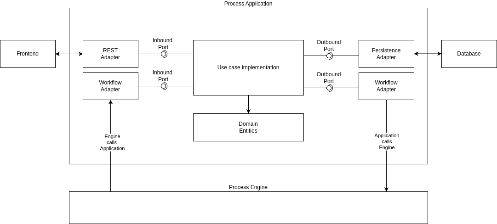

Clean Architecture is a set of principles defined
by [Uncle Bob's post back in 2012](https://blog.cleancoder.com/uncle-bob/2012/08/13/the-clean-architecture.html),
and focuses on several rules applied during system design. Those principles are originally published in different architectural approaches
and are used combined to achieve some software quality values like:

- Portability (aka independence of frameworks)
- Good Testability
- Independence of external systems

Our experience of building Process Applications showed that the application of Clean Architecture delivers those values to process applications as well.
Considering the application of Clean Architecture principle, the architectural blueprint would result in something similar to the following:

### Inbound Adapters

Inbound adapters are responsible for initiating the control flow of the application. There are typically multiple inbound adapters for different entry points:

- **REST Adapter**: A common adapter that provides HTTP endpoints for access by a frontend or other services.
- **Message Consumers**: Adapters that listen for external events or messages to trigger application logic.
- **Workflow Callback Adapter**: In the context of process applications, this is a crucial component. Whenever the process orchestration needs to invoke
  specific business functionality, the process engine uses this adapter to access the implementation of a particular use case. Most process engines provide APIs
  to register such callbacks.

### Outbound Adapters

On the outbound side, the application relies on third-party technologies integrated via outbound ports. Following the dependency rule, the application code
never references any adapters directly. Instead, it uses **Dependency Inversion**: the use case implementation only has a reference to an outbound port (
interface), and the IoC container provides the actual adapter implementation at runtime.

The specific part for process applications is the **Workflow Outbound Adapter**, which is responsible for forwarding calls to the process engine. This adapter
translates process-related operations—such as starting new process instances or completing user and service tasks—into vendor-specific API calls.

### Role of the Process Engine API

The `Process Engine API` provides a vendor-agnostic abstraction for the **Workflow Adapter**. It uses a set of adapter modules that translate these abstract
calls into vendor-specific API calls (e.g., Camunda 7, Camunda 8, CIB Seven). By using this abstraction, your application code remains technology-independent
and portable.

