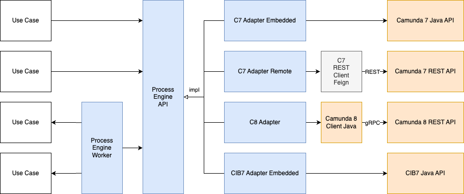

# Library Components

This section explains how the different library components are structured and how they work together in a process application.

### The Core: Process Engine API

The `Process Engine API` is the central component of our library. It defines a set of vendor-agnostic interfaces (Ports) for common process engine operations:

- **Deployment**: Deploying process definitions.
- **Process Instance Management**: Starting, signaling, and correlating messages to process instances.
- **Task Management**: Completing user tasks, modifying task attributes, and handling service task completions.
- **Task Subscription**: Subscribing to external tasks or user tasks events.

By using these interfaces in your application's domain layer, you decouple your business logic from the specific process engine technology.

### Outbound: Process Engine Adapters

To make the `Process Engine API` work with a real engine, you need a **Process Engine Adapter**. These adapters are "drop-in" dependencies that implement the
API interfaces for a specific vendor and communication style:

- **Camunda 7 Adapter**: Supports both **Embedded** (via Java API) and **Remote** (via REST API) configurations.
- **Camunda 8 Adapter**: Integrates with Camunda 8 (SaaS or Self-Managed) using the gRPC-based Zeebe client.
- **CIB Seven Adapter**: Provides integration for the CIB Seven process engine.

At runtime, the application uses **Dependency Inversion**: your use cases depend on the `Process Engine API` interfaces, and the chosen adapter provides the
implementation.

### Inbound: Workflow Callback Adapter: Process-Engine-Worker

While the outbound adapters allow the application to call the engine, **Workflow Callback Adapters** handle the reverse: the process engine calling the
application.

In a Clean Architecture setup, these adapters are responsible for:

1. **Receiving calls** from the process engine (e.g., via a Service Task or a User Task Subscription).
2. **Translating** the engine-specific data into domain objects.
3. **Invoking** the appropriate application Use Case.

The Process Engine Worker is a special type of Workflow Callback Adapter that is responsible for delivering External Service Tasks to the application.

### Putting it together

When you build an application using these components, the structure typically looks like this:

1. **Domain/Use Case Layer**: Uses the `Process Engine API` to interact with processes.
2. **Infrastructure Layer (Outbound)**: Includes one of the `Process Engine Adapters` to talk to the engine.
3. **Infrastructure Layer (Inbound)**: Contains `Process Engine Workers` that trigger Use Cases when the engine reaches specific points in the process.

This separation ensures that your application is future-proof: if you decide to switch from Camunda 7 to Camunda 8, you only need to change the outbound adapter
dependency and configuration; your core business logic remains untouched.
